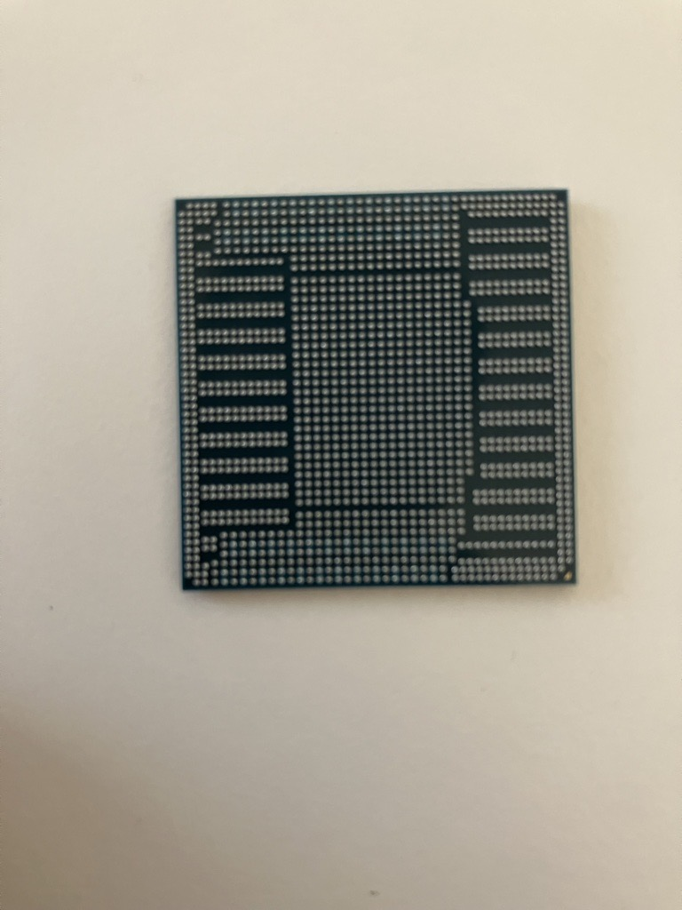
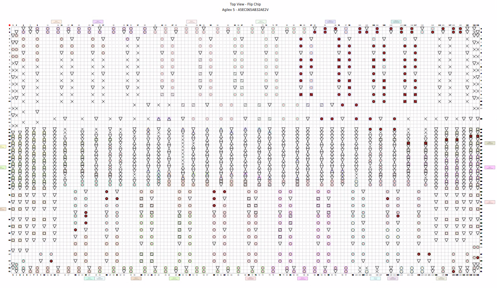
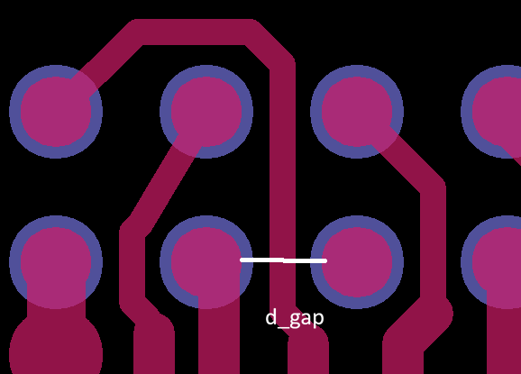

# Agilex 5 packaging

Agilex 5 devices use two types of package 

- VPBGA packages = 0.65mm partially depopulated array
- MBGA packages = 0.5mm full array

The MBGA package allows greatest pin density but requires a HDI process for Type IV vias.  The [routing guidelines](https://docs.altera.com/r/docs/821801/current/pcb-design-guidelines-hssi-emif-mipi-true-differential-pdn-user-guide-agilextm-5-fpgas-and-socs/typical-design-rules-for-type-iv-hdi-in-a-0.5-mm-mbga) have a useful table to compare with your fabricator's capabilities.

The VPBGA package allows for high pin density while *not* requiring HDI.  The [Agilex 5 PCB guidelines](https://docs.altera.com/r/docs/821801/current/pcb-design-guidelines-hssi-emif-mipi-true-differential-pdn-user-guide-agilextm-5-fpgas-and-socs/) say that design rules are similar top those for 0.8mm BGAs on a Type III with standard PTH vias.  Note that the recommended footprint includes larger pads at the corners.

| ||

Avoiding the need for HDI and fine features is a benefit for fabrication time, cost and availability.

## Pin functions

The easiest way to see the pin functions is to use the pin planner:

## Assessing PCB fabricators

### Track and gap

When designing for the VPBGA package, using the recommended footprint, the space between pads is calculated:

$d_{pitch}=650\mu m$

$r_{pad}=305\mu m$

$d_{padgap}=d_{pitch}-r_{pad}=345\mu m$

To route a trace between two pads:

$d_{padgap}=2.d_{gap}+d_{track}$

Gap and track can be read from a PCB fabricator's technical capability.  Track and gap are often the same, so $100\mu m$ track and gap is required

### Drill and annular ring

I want to place a via between two pads.  Use Pythagoras' theorem to calculate the diagonal between centres:

$A=\sqrt{B^{2}+C^{2}}\Rightarrow d=\sqrt{650^{2}+650^{2}}=919\mu m$

The maximum pad size for the via is then defined:

$d_{diagonal}=2.d_{gap}+r_{pad-via}+r_{pad}\Rightarrow r_{pad}=d_{diagonal}-2.d_{gap}-r_{pad-via}=414\mu m$ or if only $75 \mu m$ gap is required, a $464 \mu m$ pad could be accommodated.

The pad radius is defined in terms of drill diameter and annular ring:

$r_{pad}=d_{drill}+2.d_{annular-ring}$

For example, a $150\mu m$ drill and annular ring allows a $450 \mu m$ pad which is within the maximum size to place between 4 pads.

Some fabricators have a separate PTH to copper specification instead of using ring + gap.  An example set of capabilities that would match using the VFBGA package with PTH only (also referred to as multilayer) is:

| parameter    | value um |
| ------------ | -------- |
| track        | 100      |
| gap          | 75       |
| drill width  | 150      |
| annular ring | 150      |
|              |          |

## Escape routing

Areas of the BGA with IO pins are partially depopulated to allow wide routing lanes - 1mm gap allows 13 traces with $75 \mu m$ track/gap.

## Conclusion

The VPBGA allows lower layer count and more relaxed PCB rules than you might expect from a fine pitch BGA package.  These characteristics widen the choice of PCB fabricator for the designer _and_ shorten lead times due to simpler manufacturing processes compared to HDI PCBs (especially Type II and Type III).

## References

[Agilex 5 board design](https://www.altera.com/design/agilex-5/design-hub/board)